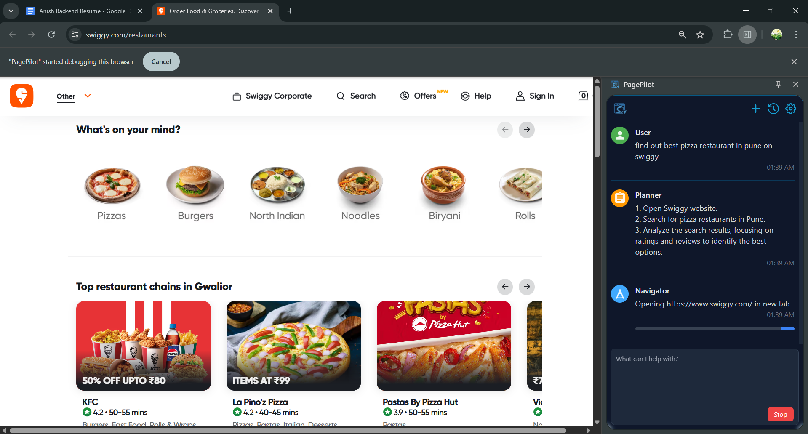
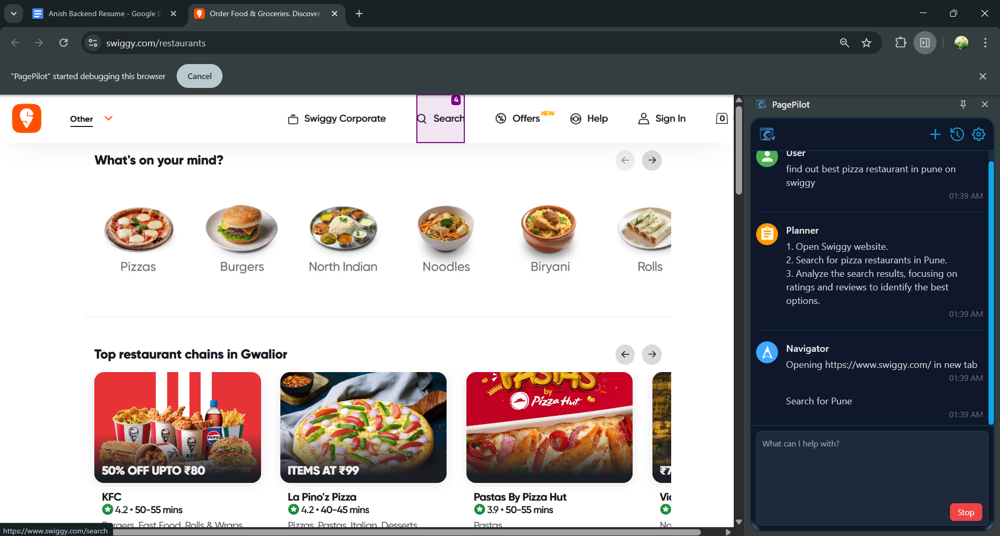
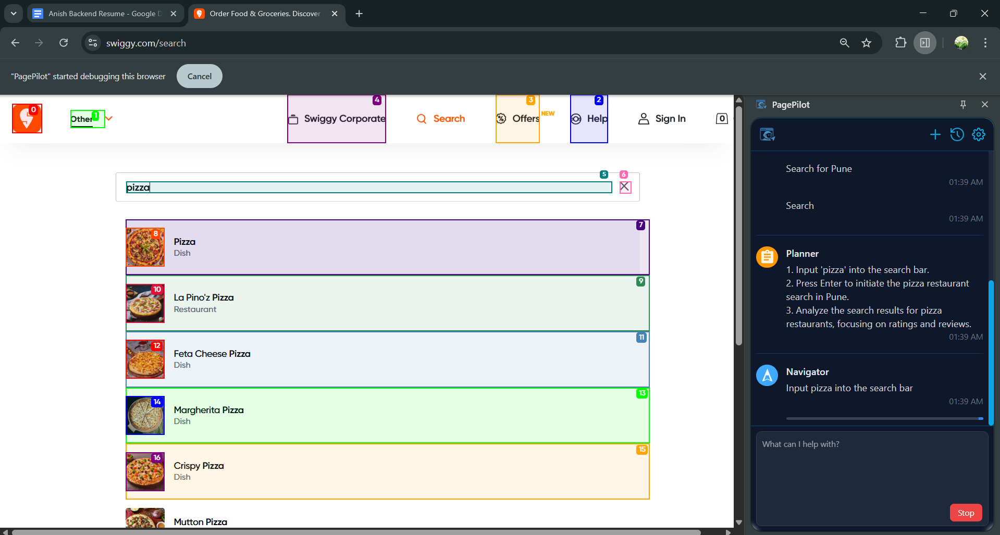
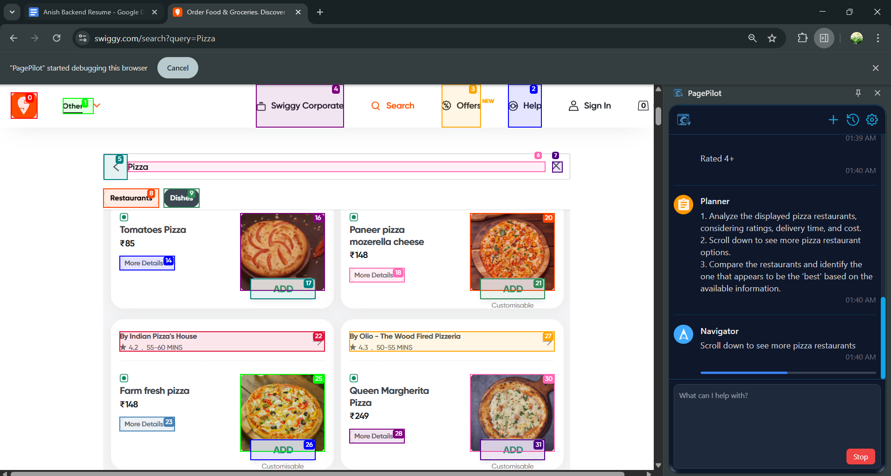
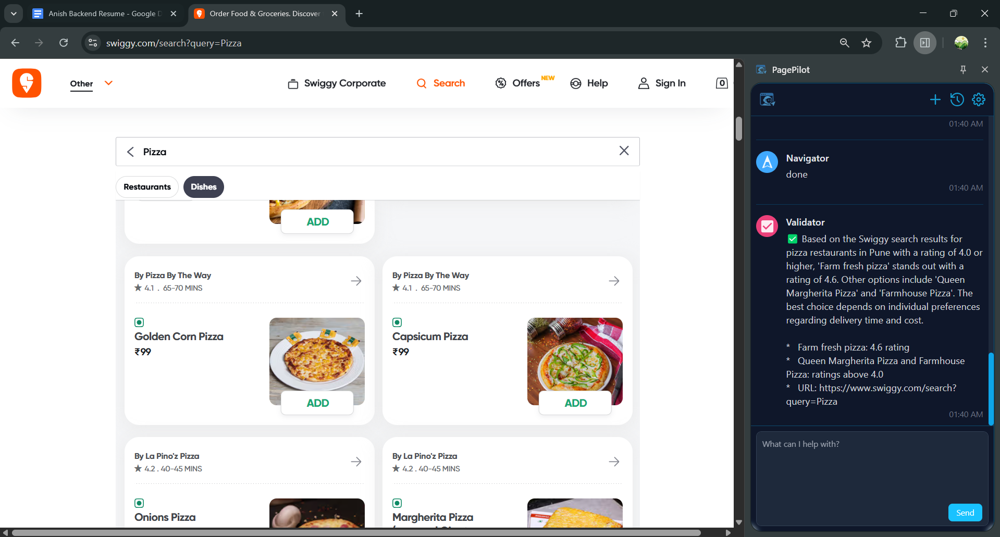

## 🌐 PagePilot

PagePilot is an open-source AI web automation tool that runs in your browser. A free alternative to OpenAI Operator with flexible LLM options and multi-agent system.

## 🔥Why PagePilot?

Looking for a powerful AI web agent without the $200/month price tag of OpenAI Operator? **PagePilot** , as a chrome extension, delivers premium web automation capabilities while keeping you in complete control:

- **100% Free** - No subscription fees or hidden costs. Just install and use your own API keys, and you only pay what you use with your own API keys.
- **Privacy-Focused** - Everything runs in your local browser. Your credentials stay with you, never shared with any cloud service.
- **Flexible LLM Options** - Connect to your preferred LLM providers with the freedom to choose different models for different agents.
- **Fully Open Source** - Complete transparency in how your browser is automated. No black boxes or hidden processes.


## 🎬 PagePilot in action
PagePilot on search query "find out best pizza restaurant in pune on swiggy"












## 📊 Key Features

- **Multi-agent System**: Specialized AI agents collaborate to accomplish complex web workflows
- **Interactive Side Panel**: Intuitive chat interface with real-time status updates
- **Task Automation**: Seamlessly automate repetitive web automation tasks across websites
- **Follow-up Questions**: Ask contextual follow-up questions about completed tasks
- **Conversation History**: Easily access and manage your AI agent interaction history
- **Multiple LLM Support**: Connect your preferred LLM providers and assign different models to different agents


## 🔧 Manually Install Latest Version

To get the most recent version with all the latest features:

1. **Download**
    * Download the latest `PagePilot.zip` file from the official Github [release page](https://github.com/PagePilot/PagePilot/releases).

2. **Install**:
    * Unzip `PagePilot.zip`.
    * Open `chrome://extensions/` in Chrome
    * Enable `Developer mode` (top right)
    * Click `Load unpacked` (top left)
    * Select the unzipped `PagePilot` folder.

3. **Configure Agent Models**
    * Click the PagePilot icon in your toolbar to open the sidebar
    * Click the `Settings` icon (top right).
    * Add your LLM API keys.
    * Choose which model to use for different agents (Navigator, Planner, Validator)

4. **Upgrading**:
    * Download the latest `PagePilot.zip` file from the release page.
    * Unzip and replace your existing PagePilot files with the new ones.
    * Go to `chrome://extensions/` in Chrome and click the refresh icon on the PagePilot card.

## 🛠️ Build from Source

If you prefer to build PagePilot yourself, follow these steps:

1. **Prerequisites**:
   * [Node.js](https://nodejs.org/) (v22.12.0 or higher)
   * [pnpm](https://pnpm.io/installation) (v9.15.1 or higher)

2. **Clone the Repository**:
   ```bash
   git clone https://github.com/PagePilot/PagePilot.git
   cd PagePilot
   ```

3. **Install Dependencies**:
   ```bash
   pnpm install
   ```

4. **Build the Extension**:
   ```bash
   pnpm build
   ```

5. **Load the Extension**:
   * The built extension will be in the `dist` directory
   * Follow the installation steps from the Manually Install section to load the extension into your browser

6. **Development Mode** (optional):
   ```bash
   pnpm dev
   ```

## 🤖 Choosing Your Models

PagePilot allows you to configure different LLM models for each agent to balance performance and cost. Here are recommended configurations:

### Better Performance
- **Planner & Validator**: Claude 3.7 Sonnet
  - Better reasoning and planning capabilities
  - More reliable task validation
- **Navigator**: Claude 3.5 Haiku
  - Efficient for web navigation tasks
  - Good balance of performance and cost

### Cost-Effective Configuration
- **Planner & Validator**: Claude Haiku or GPT-4o
  - Reasonable performance at lower cost
  - May require more iterations for complex tasks
- **Navigator**: Gemini 2.0 Flash or GPT-4o-mini
  - Lightweight and cost-efficient
  - Suitable for basic navigation tasks

### Local Models
- **Setup Options**:
  - Use Ollama or other custom OpenAI-compatible providers to run models locally
  - Zero API costs and complete privacy with no data leaving your machine

- **Recommended Models**:
  - **Qwen 2.5 Coder 14B**
  - **Mistral Small 24B**

- **Prompt Engineering**:
  - Local models require more specific and cleaner prompts
  - Avoid high-level, ambiguous commands
  - Break complex tasks into clear, detailed steps
  - Provide explicit context and constraints

